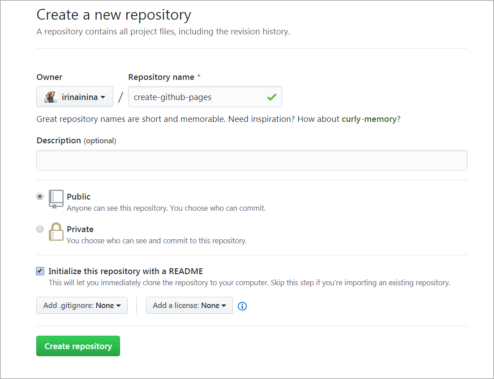
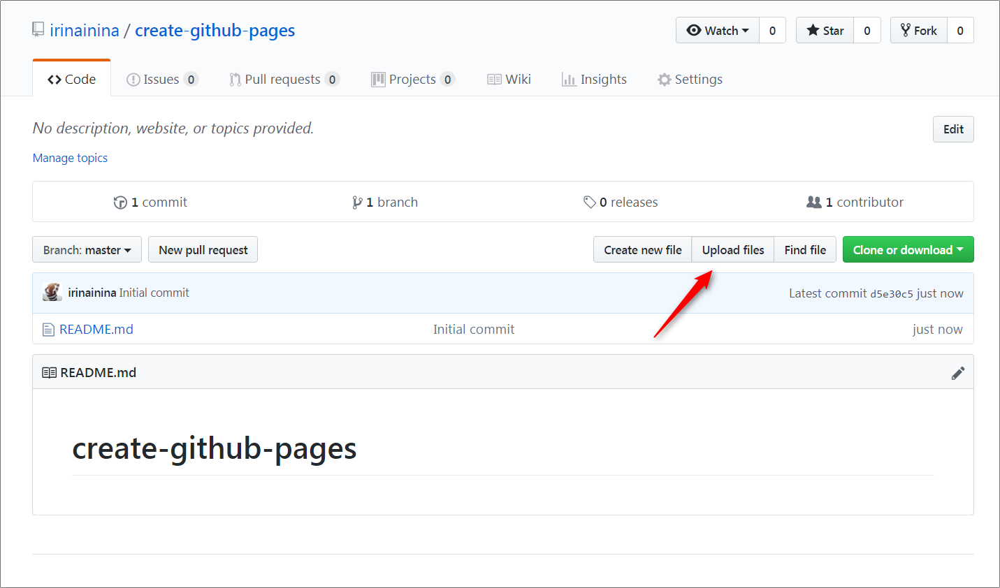
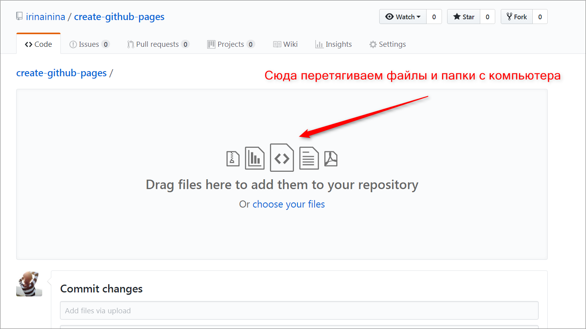
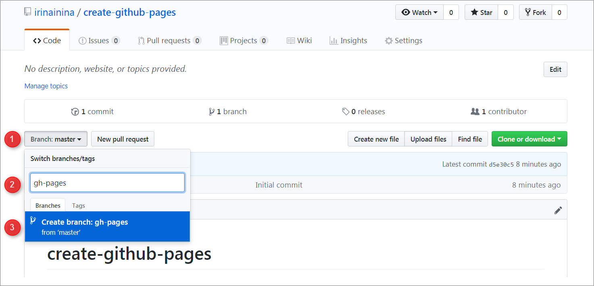
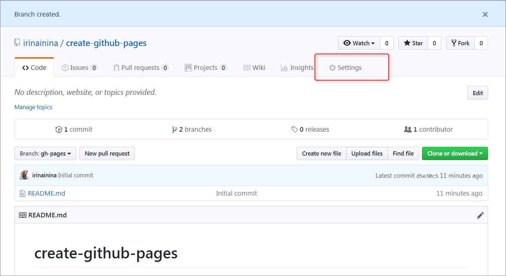
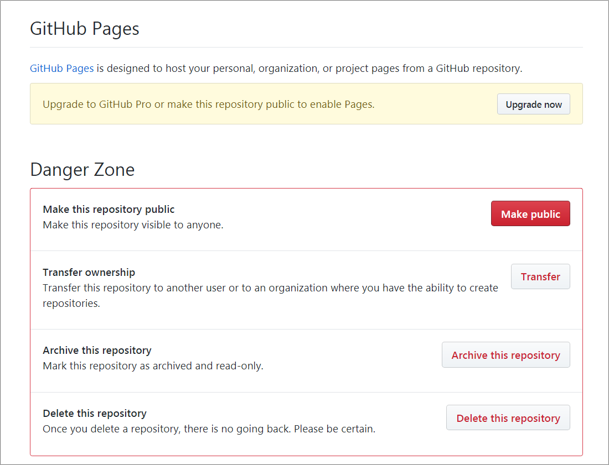

# create-github-pages

Показать как будет выглядеть созданное приложение можно разместив его на GitHub Pages.  

Если гуглить решение, большинство результатов будут об устаревшем и неоптимальном способе создания GitHub Pages, который начинается с создания в своём аккаунте репозитория с именем *username.github.io*. А так как такой репозиторий может быть в аккаунте только один, для каждой страницы раньше требовалось создавать новый аккаунт. Новый способ в разы проще и удобнее. 

# Как создать GitHub Pages.

1. Создаём репозиторий на гитхабе, добавляем в него файлы. Файлы можно загрузить как через гит, так и через интерфейс самого гитхаба. в последнем случае при создании репозитория обязательно отмечаем галочкой пункт Initialize this repository with a README. (рис 1) 

В созданном репозитории нажимаем на кнопку Upload files (рис 2) 

В появившееся поле перетягиваем файлы и папки с папки на компьютере (рис 3). 

Эта возможность хорошо работает в Google Chrome, в других браузерах могут быть проблемы 

2. В созданном репозитории нажимаем на кнопку **Bransh master**, в текстовое поле вписываем *gh-pages*, нажимаем на синюю кнопку **Create branch: gh-pages**. Мы создали ветку gh-pages. (рис 4)

3. Идём в настройки репозитория (шестерёнка с надписью **Settings** справа вверху). (рис 5)

Прокручиваем до пункта **GitHub Pages**. Если здесь уже находится ссылка на созданную страницу,  больше ничего делать не нужно, GitHub Pages создана. Ссылка будет примерно такая https://your-githab-account.github.io/your-repository-name/ (рис 6)  

Если ссылки нет, нужно выбрать из какой ветки репозитория будет создана GitHub Pages. Выбираем *gh-pages*. Появляется надпись **Your site is ready to be published at** */здесь ссылка /*. Поздравляю. Страница GitHub Pages создана. Если не создана, переходим к следующему шагу.

4. GitHub Pages создаются на основе загруженного в репозиторий файла *index.html*. Если такого файла нет или он находится не на верхнем уровне, например, помещён внутрь папки, при создании GitHub Pages может появиться ошибка. Ошибки не будет, если файла *index.html* на верхнем уровне нет, но есть markdown-файл. GitHub Pages может создаваться и на основе markdown тоже.  

5. Про приватные репозитории. Создавать GitHub Pages на основе приватных репозиториев могут только пользователи **pro**-аккаунтов, для пользователей обычных аккаунтов эта возможность недоступна. (рис 7)

Чтобы изменить настройки доступа и сделать приватный репозиторий публичным, в настройках репозитория прокручиваем страницу вниз до поля **Danger Zone**, нажимаем на кнопку **Make this repository public**, для подтверждения вводим адрес созданного репозитория.

6. Если открывать приватный репозиторий не хочется, приложение из приватного репозитория на GitHub можно разместить на https://www.netlify.com/
Для этого авторизуемся на netlify, нажимаем на кнопку New site from Git и указываем репозиторий на GitHub, где находится наше приложение.

Netlify позволяет разместить приложение, код которого находится в локальной папке на компьютере. Для этого достаточно открыть страницу https://app.netlify.com/drop и перетянуть папку с кодом приложения в прямоугольник с надписью "Drag and drop your site". 

Как и при деплое на GitHub Pages, деплой приложения на Netlify возможен, если файл index.html находится на верхнем уровне.

